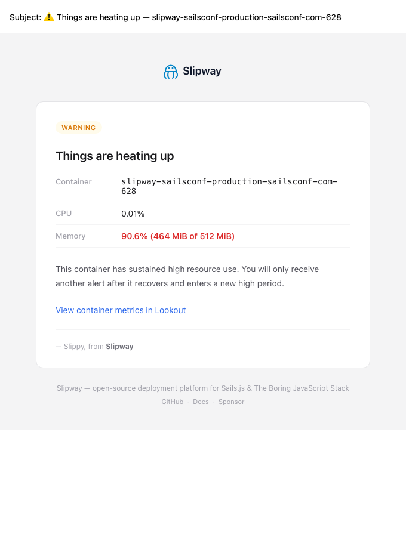
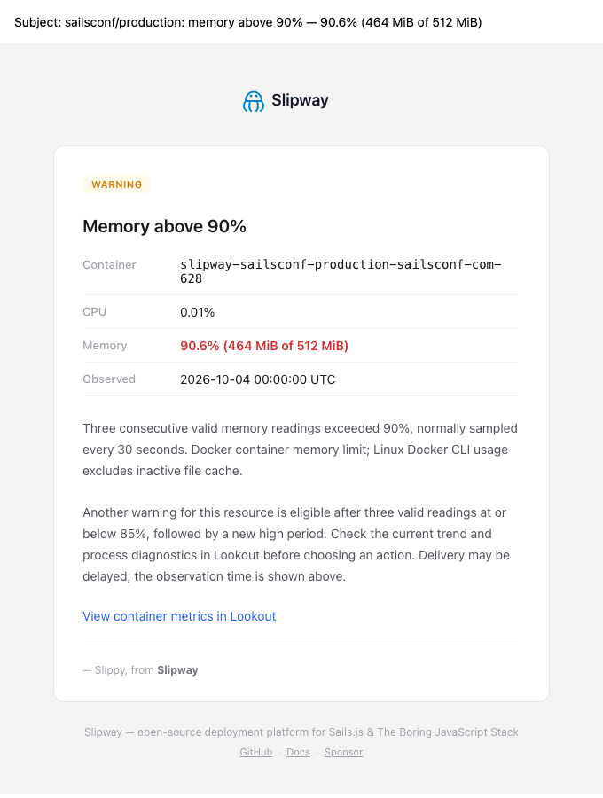

# Resource alerts: detection and durable delivery

Lookout warns separately for CPU and memory after three consecutive valid readings strictly above 90%. Sampling normally occurs every 30 seconds: the three readings usually span about 60 seconds, rather than proving uninterrupted high usage between readings. Three readings at or below 85% rearm that resource. Readings between 85% and 90% do not rearm it. A gap longer than two minutes resets consecutive-reading counters and preserves an active incident.

Malformed or incomplete Docker readings are skipped, including missing percentages, unknown byte units, and zero memory limits. They cannot count toward recovery. The Docker stats command has a ten-second deadline and a 1 MiB output bound. CPU readings above 100% remain valid: Docker's 100% represents one CPU core, not the configured CPU quota. Memory percentage uses the container limit; Linux Docker CLI usage subtracts inactive file cache.

## Message examples

The subject identifies the project/environment, resource, threshold, and observed measurement. The body adds the UTC observation time, threshold and recovery rules, denominator, and a link selecting the affected container in Lookout. Delivery may be delayed, so the message asks the reader to inspect current metrics.

Before:

After:

[Mobile rendering](images/resource-alert-after-mobile.png). These are synthetic fixture renders of the actual EJS template and mail layout, not a live email or the user's screenshot. Regenerate with `node scripts/render-resource-alert-examples.js`; Playwright checks desktop and mobile horizontal overflow.

## Delivery contract

Detection enqueues a resource-specific incident before advancing its durable state. The unique key uses the container, resource, and previous sample time, making a retry after a crash before state persistence idempotent. An installation upgraded with an already active legacy incident seeds one delivery from a fresh high sample. Existing receipt rows prevent repeated seeding.

Delivery runs independently every 30 seconds. Each invocation claims at most five due incidents with an atomic conditional SQLite lease and a unique ownership nonce. Each incident attempts at most three destinations, rotating the batch so a repeatedly failing first recipient cannot starve later ones. Successful destinations are acknowledged immediately before attempting the next. Destination identities are hashed in receipts; email addresses and webhook credentials are not stored there or logged in delivery failures. Payloads contain measurement and routing context, not notification credentials.

Email recipients are trimmed, case-folded, and deduplicated. A failed destination does not stop the remaining batch. SMTP, Telegram, Slack, Discord, and webhook delivery use the existing configured providers. The general email helper also deduplicates and isolates recipient failures; only resource alerts gain this durable outbox.

Disabled or missing channels remain pending and are checked again after five minutes. Already acknowledged enabled channels are skipped when another channel is re-enabled. Failed attempts back off for 1, 2, 4, 8, 16, then at most 30 minutes. Each destination has a 60-second acknowledgement deadline; HTTP channels also have ten-second fetch deadlines. An uncertain acknowledgement retains its lease for 15 minutes, allowing a late SMTP acknowledgement to be recorded before another attempt. A restarted process resumes after an outstanding lease expires.

Delivery requires a valid sample no older than two minutes and no earlier than the incident observation. A fresh recovered state cancels unsent delivery. A new high episode also supersedes older pending observations, including outstanding leases that span recovery. Stale state waits for another sample. Undelivered incidents expire after seven days with an explicit outcome and warning. Terminal rows are pruned in bounded batches; the latest receipt for an active resource is retained until recovery, preventing seven-day pruning from triggering repeated legacy backfill.

This is durable retry with acknowledged-destination suppression, **not exactly-once external delivery**. A provider can accept a message just before the process crashes or receipt persistence fails. Deterministic SMTP Message-ID values and the uncertain-delivery hold reduce duplication; providers are not assumed to deduplicate them. Pending destinations follow current notification settings, so a newly configured destination can receive an outstanding incident.

## Additive migration

Startup's existing observability schema helper adds only:

- `resource_alert_deliveries`, containing incident identity, observation payload, per-destination receipts, status, attempt/backoff fields, and lease ownership.
- `resource_alert_deliveries_due (status, next_attempt_at, lease_until)`.
- `resource_alert_deliveries_container_resource (container_name, resource, observed_at)`.

No existing table is altered or dropped. The migration contract test runs the schema helper twice against an existing SQLite database, preserves a legacy incident, verifies the new table, and checks indexed due queries. ORM fixture databases may encode booleans as numeric text; the retention predicate accepts both that encoding and production integer columns. All migration verification here is local; no production schema, deployment, credential, or notification was changed. Normal release backup and upgrade gates still apply before deployment.

## Collector impact and verification

[Recorded benchmark data](evidence/resource-alert-collector-benchmark.json) compares baseline commit `0fb573776551106a91a4d0f67f6a2be3712d5513` with this implementation. Run `node scripts/benchmark-resource-alert-collector.js` to repeat it.

Seven paired synthetic runs, each containing 100 collector cycles with 50 healthy containers, produced median totals of 4.8145 ms before and 5.3539 ms after: approximately 5.39 microseconds more per 50-container cycle. Both performed 5,000 state reads and 5,000 state writes, with zero outbox reads or writes in the healthy collector path. For 50 already active incidents, the collector adds one indexed existence read per active resource per cycle for legacy backfill. The separate idle dispatcher performs one due query per 30-second tick; 10,000 empty local SQLite queries averaged 0.333 microseconds each.

These are synthetic measurements with mocked model latency, excluding Docker, network delivery, and production load. They establish operation counts and separation, not production latency or a performance improvement. A hook test holds delivery unresolved while subsequent collector cycles complete. Other focused tests cover real SQLite claims and receipts, concurrent drainers, restart/lease expiry, disabled and re-enabled settings, partial failures, recovery and gaps, bounded batches, late acknowledgement, retention, strict sample parsing, and additive migration.
